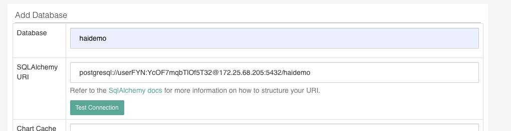

# Instructions for deployment on OpenShift
These instructions show how to deploy various applications on [OpenShift](https://okd.io)
using the [command line client tool](https://docs.okd.io/latest/cli_reference/get_started_cli.html). Created and tested using [CodeReady Containers](https://developers.redhat.com/products/codeready-containers/overview).

## Prerequisites

* A terminal shell with the OpenShift client tool (`oc`) available.

* An active login to an OpenShift project

## Recommended Workflow

### Download Open Data Hub

Once inside your OpenShift environment, install Red Hat's AI-as-a-Service platform, Open Data Hub, using the instructions [here](https://opendatahub.io/docs/getting-started/quick-installation.html), when creating a KfDef in step 4 of "Create a New Open Data Hub Deployment," use the [odh-hai-deploy.yaml]('./odh-hai-deploy.yaml') file rather than the YAML given in the Open Data Hub installation guide.

### Load this repo into your cluster

Load the Open Data Hub application JupyterHub. On the landing page, copy the link to this repo where prompted.

### Create a PostgreSQL database

1. Create a PostgreSQL database by using the command line prompt `oc new-app --name=postgresql --template=postgresql-persistent` (Note that a username and password will be auto-generated and display after running this command. You will need this login info later!) 

2. Enter into this service's CLI with `oc rsh postgresql-X-XXXXX`, where the X's are replaced by the full name of the pod (full name is retrievable by `oc get pods`).

3. Once in the remote shell, use the command `psql -d postgres` to connect to PostgreSQL. Once inside, use the SQL command `CREATE DATABASE haidemo;` to create your **haidemo** database.

4. To exit the database, type `\quit` 

5. To exit the remote shell, type `exit`

6. Follow the notebook [superset-pg-setup]('./superset-pg-setup.ipynb') to create an engine to upload your data into the PostgreSQL database and create a URI to connect the database to other applications.
 

### Explore the data more in Superset

[Superset](apache-superset.io) is a visualization dashboard that connects with nearly any database in order to further explore the data or implement business intelligence techniques. To get started with Superset, 
1. Login to the Superset pod through OpenShift. The default username and password are both _admin_.
2. Connect your PostgreSQL database by clicking on Sources > Databases. Click the + button in the top right corner to add a new record. Name your database and use the URI that you created in the **Create a PostgreSQL database** step. 

3. Check "Expose in SQL Lab" option, and any other options you may want to explore.
4. Save your database.
